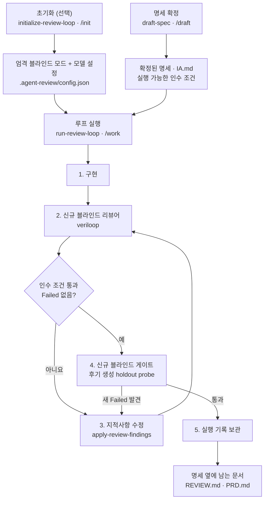

<p align="center">
  <a href="./README.md"></a>
  <a href="./README.ko.md"></a>
</p>

# Veriloop

Codex와 Claude Code에서 함께 사용하는 **명세 기반 코드 리뷰·수정 루프**입니다.

에이전트가 작성한 변경을 다섯 관점으로 검증하고, 실패 항목이 사라지고 목표의 인수 조건이 실제 명령으로 확인될 때까지 최대 3회 반복합니다.

<p align="center">
  <a href="#설치"></a>
  &nbsp;&nbsp;
  <a href="#권장-워크플로"></a>
</p>

<p align="center">
  <kbd>스킬 6</kbd>
  <kbd>리뷰 관점 5</kbd>
  <kbd>지원 Codex + Claude</kbd>
  <kbd>블라인드 모드 엄격</kbd>
</p>

<p align="center">
  <a href="https://github.com/dev-geon/veriloop/stargazers"></a>
  <a href="https://github.com/dev-geon/veriloop/releases/latest"></a>
  <a href="https://github.com/dev-geon/veriloop/blob/main/LICENSE"></a>
</p>

## 스킬 아키텍처



`veriloop`는 단독으로도 사용할 수 있습니다. 확인된 명세가 없으면 먼저 `draft-spec`으로 연결되며, 명세 없는 변경을 추측으로 승인하지 않습니다.

## 권장 워크플로

| 단계 | Codex | Claude Code | 결과 |
|---|---|---|---|
| 0. 역할별 모델 설정 *(선택)* | `$initialize-review-loop` | `/init` | 엄격 블라인드 모드, 모델 설정, findings ledger |
| 1. 작업 명세 확정 | `$draft-spec` | `/draft` | `IA.md` — 저장소 규칙과 실행 가능한 인수 조건이 포함된 명세 |
| 2. 구현·리뷰·수정 실행 | `$run-review-loop <목표>` | `/work <목표>` | 검증된 변경, `REVIEW.md`의 최종 판정, 성공 시 `PRD.md` |

### 0. 루프 초기화 *(선택)*

개발자·수정자·리뷰어·최종 게이트에 사용할 모델을 저장소별로 선택합니다.

```text
# Codex
$initialize-review-loop

# Claude Code
/init
```

설정과 `"blind_mode": "strict"`는 `.agent-review/config.json`에 저장됩니다. 지정한 모델을 사용할 수 없으면 다른 모델로 몰래 대체하지 않고 루프를 중단합니다.

### 1. 명세 작성과 확인

`draft-spec`은 저장소의 `AGENTS.md` / `CLAUDE.md`, 관련 코드, 테스트, 기존 패턴을 먼저 조사한 뒤 작업 명세를 만듭니다. 각 인수 조건에는 테스트 명령이나 검색 assertion처럼 **그대로 실행할 수 있는 확인 방법**이 연결됩니다.

```text
# Codex
$draft-spec 차량별 연료 합계 API를 추가해줘

# Claude Code
/draft 차량별 연료 합계 API를 추가해줘
```

초안은 독립적인 guess-hunt 검토를 거쳐, 근거 없이 가정한 결정을 찾아냅니다. 사용자가 명세를 확인하기 전에는 구현 루프가 시작되지 않습니다.

### 2. 목표와 함께 루프 실행

목표에는 확정된 명세와 검증 가능한 완료 조건을 적습니다.

```text
# Codex
$run-review-loop docs/fleet-fuel-spec.md 기준으로 연료 합계 API를 구현하고 기존 호출자와 데이터 호환성을 유지해줘

# Claude Code
/work docs/fleet-fuel-spec.md 기준으로 연료 합계 API를 구현하고 기존 호출자와 데이터 호환성을 유지해줘
```

루프 내부에서는 다음 순서가 반복됩니다.

1. 기존 diff가 없다면 명세에 맞게 구현합니다.
2. 고유한 신규 블라인드 리뷰어가 `veriloop`의 다섯 관점으로 변경을 검토합니다.
3. 인수 조건을 실제 명령으로 실행하고 `Failed` 여부를 확인합니다.
4. 실패 항목을 수정한 뒤 다시 리뷰합니다.
5. 완료 후보를 고정하고, 별도의 신규 블라인드 게이트가 구현 후 새로운 holdout probe를 생성해 검증합니다.

### 엄격한 블라인드 모드 *(기본값)*

개발자는 명세와 기본 인수 조건을 받지만 리뷰 보고서, 리뷰 체크리스트,
게이트 계획, holdout probe, 리뷰어의 추론은 받지 않습니다. 매 반복 리뷰어와
최종 게이트는 서로 다른 신규 서브에이전트이며, 저장소·고정된 대상·확정 명세·
범위 경계·위험 초점만 전달받습니다. ledger와 이전 기록은 controller만 관리합니다.

최종 게이트는 완료 후보가 고정된 뒤 경계값·비정상 입력, 상태 순서, 실패 주입,
property/metamorphic·차등 동작, 테스트 강도와 같은 후기 생성 probe를 만듭니다.
대상 작업 트리는 수정할 수 없습니다. 실행 환경이 깨끗한 신규 서브에이전트를
지원하지 않으면 루프를 중단하고, 해당 실행에 한해서만 독립성 완화를 승인할지
묻습니다. 완화 모드는 저장되지 않으며 이전 승인도 재사용하지 않습니다.

### 3. 종료와 결과 확인

루프는 아래 조건을 모두 만족해야 성공으로 끝납니다.

- 명세의 실행 가능한 인수 조건이 모두 통과
- 리뷰 판정이 `Pass` 또는 `Pass with warnings`
- 고정 snapshot이 바뀌지 않고 후기 생성 probe가 모두 통과하며 게이트에서 새로운 `Failed`가 발견되지 않음

안전장치로 최대 3회까지만 반복하며, 실패 항목이 줄지 않거나 되살아나는 경우 사용자에게 판단을 요청합니다. `Warning`만 남은 경우에는 루프를 계속 돌리지 않고 각각 수용·이슈 등록·즉시 정리 중 하나로 처리합니다.

완료된 실행은 `.agent-review/runs/`에 보관됩니다.

### 루프가 남기는 문서

세 파일이 확정된 명세와 같은 폴더에 함께 놓입니다.

| 파일 | 내용 | 작성 주체 |
|---|---|---|
| `IA.md` | 명세 — 요구사항과 실행 가능한 인수 조건 | `draft-spec` |
| `REVIEW.md` | findings(severity·`file:line` 근거), 판정, 머신리더블 JSON 블록 | 단독 리뷰·루프 내부 리뷰 모두 |
| `PRD.md` | 제품 문서 — 무엇인지·누가 쓰는지·무엇을 하는지·어떻게 동작하는지·비기능 요구, 인수 조건별 Pass/Fail과 근거를 담은 검증 장, 남은 일 | `run-review-loop`, `goal_met` 종료에서만 |

`IA.md`가 계약이고 `REVIEW.md`가 감사라면, `PRD.md`는 **지금 무엇이 존재하는가**를 그 자리에 없던 사람에게 설명하는 문서입니다. 인수 조건 표는 그 안의 한 장이지 문서 전부가 아닙니다. 반복 상한·무진전·worker 중단으로 끝난 실행은 제품 문서를 남기지 않고, 그 이유를 리포트에 적습니다.

여러 작업으로 이루어진 프로그램에서는 같은 쌍이 두 계층으로 확장됩니다. 상위 디렉토리의 `IA.md`·`PRD.md`가 전체를 설명하고, 각 작업은 자기 디렉토리에 자기 쌍을 둡니다.

#### 문서별로 무엇을 쓰는가

**`IA.md` — 계약.** 아홉 개 절을 이 순서로 둡니다. 목적과 배경, 범위(In/Out 을 명시), `file:line` 근거를 단 현재 동작, 목표 동작, 제약(바꾸면 안 되는 것 포함), 인수 조건(각 조항마다 그것을 검증하는 정확한 확인과 짝), 위험과 경계 사례, 이 변경이 가장 나쁘게 실패하는 한 곳을 지목하는 risk focus, 참고. 실행 가능한 확인이 없는 조항은 취향 판단이므로 날카롭게 다듬거나 빼냅니다.

**`REVIEW.md` — 감사.** 나쁜 것부터 정렬한 findings 로, 각각 severity(`Failed` 는 변경을 막고 `Warning` 은 사람이 수용할 수 있음), `file:line` 근거, 구체적 실패 시나리오를 답니다. 그다음 그 findings 에서 따라 나오는 판정, 어떤 위험이 실제로 배제됐는지 말해 주는 passed checks, 자동화가 소비하는 머신리더블 JSON 블록. 검증된 세 건이 추정 열 건보다 낫습니다.

**`PRD.md` — 제품 문서.** 열 개 장을 이 순서로 둡니다.

| # | 장 | 무엇에 답하는가 |
|---|---|---|
| 1 | 무엇인가 | 한 문단. 구현의 언어가 아니라 읽는 사람의 언어로 |
| 2 | 누가 쓰는가 | 역할과 각자가 하러 오는 일 |
| 3 | 어떤 문제를 푸는가 | 이전 상황과 무엇이 달라졌는지 |
| 4 | 무엇을 하는가 | 사용자가 묶는 방식대로 묶은 기능 목록 |
| 5 | 어떻게 쓰는가 | 주 흐름 전체와 의미 있는 보조 흐름 |
| 6 | 어떻게 동작하는가 | 동작을 신뢰하려면 알아야 할 모델·데이터 흐름과 그 가정 |
| 7 | 비기능 요구 | 결정성, 결측에 대한 정직성, 접근성, 성능, 권한, 언어 |
| 8 | 검증 | 인수 조건별 Pass/Fail 과 근거 — **한 장이지 문서 전부가 아님** |
| 9 | 남은 일 | 수용한 경고, 미룬 항목, 알려진 결함과 처리 방침, 담당이 붙은 후속 작업 |
| 10 | 이 문서의 한계 | 다루지 않은 것과 주장이 기대는 근거 |

장은 작업 규모에 맞춰 늘고 줄지만(버그 하나면 장마다 한 문단, 프로그램이면 문서 전체) 자리를 아끼려고 빼지는 않습니다. 해당 없으면 그렇게 적고 이유를 씁니다. 사실 주장은 `file:line` 으로 근거를 대고, 추정은 추정이라 표시하며, 해소하지 못한 불일치는 불일치로 기록합니다.

## 필요한 기능만 사용하기

### 현재 변경만 리뷰

다음처럼 자연어로 요청하거나 `$veriloop`를 직접 호출합니다.

- “에이전트가 방금 만든 변경을 리뷰해줘”
- “커밋 전에 현재 diff를 확인해줘”
- “이 브랜치를 병합해도 안전한지 검토해줘”

리뷰 범위는 **사용자가 지정한 PR·커밋·경로 → 커밋하지 않은 변경 → 기본 브랜치와 현재 브랜치의 차이** 순으로 결정됩니다. 리뷰는 코드를 수정하지 않습니다. 리포트는 명세 옆에 `REVIEW.md`로 저장되며, 단독 리뷰는 결과 문서를 남기지 않습니다.

### 기존 리뷰 지적사항만 반영

```text
$apply-review-findings
```

`Failed` 항목을 실제 코드에서 다시 확인한 뒤 수정하고, 해결된 항목은 `Pass`로 보고합니다.

## 리뷰가 확인하는 다섯 관점

| 관점 | 확인 내용 |
|---|---|
| **Regression** | 이름이 바뀐 심볼의 미수정 호출자, 직렬화 계약 파손, 몰래 완화된 테스트 |
| **Performance** | N+1 쿼리, 반복문 안 I/O, sync-over-async, 무제한 조회, 누락된 페이지네이션 |
| **Cost** | 요청량·데이터량에 따라 증가하는 API·LLM·SMS·지도·egress·로그 비용과 Cosmos DB RU |
| **Readability** | 설명만 반복하는 주석, 과도한 방어 래핑, 추측성 일반화, 죽은 코드 |
| **Conventions** | 일반론이 아니라 현재 저장소의 규칙, 린터 설정, 인접 코드 패턴과의 차이 |

모든 finding은 실제 코드에서 재검증되며 `Confirmed` 또는 `Needs verification`으로 표시됩니다. 결과는 `Failed`와 `Warning`으로 분류하고 최종 판정은 `Pass`, `Pass with warnings`, `Fail` 중 하나입니다. 문제가 발견되지 않은 검사와 수정 완료된 finding도 명시적으로 `Pass`로 남깁니다.

## 설치

### Codex

```bash
codex plugin marketplace add dev-geon/veriloop
codex plugin add veriloop@veriloop
```

설치 후 새 Codex 작업을 시작하면 번들 스킬이 검색됩니다.

### Claude Code

```text
/plugin marketplace add dev-geon/veriloop
/plugin install veriloop@veriloop
```

별도 설정 없이 사용할 수 있으며, 리뷰할 때마다 현재 저장소의 규칙을 읽습니다.

## 실행 기록과 CI

| 경로 | 용도 |
|---|---|
| `.agent-review/config.json` | 루프 역할별 모델 설정 |
| `.agent-review/ledger.json` | 반복을 가로지르는 finding 상태: open, Pass, recurred, accepted |
| `.agent-review/runs/` | 완료된 실행 기록 |

### 자동화 신뢰성

| 계층 | 설명 |
|---|---|
| **공통 워크플로 코어** | Codex 스킬과 Claude Code 슬래시 명령이 동일한 명세·리뷰·수정·게이트 지침을 사용해 두 플랫폼에서 하나의 동작 계약을 따릅니다. |
| **역할 격리 전달** | 개발자·수정자·리뷰어·게이트·controller는 각 책임에 필요한 입력만 받습니다. 개발자와 수정자의 완료 상태는 성공과 timeout·취소·컨텍스트 한도·도구 실패·잘못된 결과를 명시적으로 구분합니다. |
| **스키마 기반 결과** | worker·리뷰·게이트·실행 기록은 `schemas/`의 JSON Schema를 따릅니다. worker 결과는 16KiB로 제한하며 긴 로그는 검증된 artifact로 보관하고 정상 경로에서는 controller나 reviewer 컨텍스트에 넣지 않습니다. |
| **Controller 계약 회귀 검사** | 외부 의존성이 없는 로컬 검사가 실제 fixture assertion을 실행하고 strict/reduced 전환, 신규 리뷰어 식별자, 최종 revision 인수 조건, 고정 snapshot, archive 일관성, no-progress 중단, 게이트 실패 복구를 실제 모델 실행 전에 검증합니다. |

```bash
python3 evals/run_contract_evals.py
```

이 검사는 API 호출 없이 핵심 controller trace 3개, 명시적으로 승인된 reduced 전환 1개, worker 종료 전환 3개, 워크플로 적대적 변형 24개, 정상 worker 결과 7개, worker 결과 변형 21개, raw-JSON fallback 경로 6개를 확인합니다. 오케스트레이션 기록과 실행 증거를 검증하는 용도이며, 실제 모델 컨텍스트 격리와 주관적인 리뷰 품질은 신규 서브에이전트를 사용하는 live forward test로 확인해야 합니다.

모든 리뷰 보고서 끝에는 `verdict`와 `findings[]`를 포함한 기계 판독용 JSON 블록이 붙습니다. 스키마 설명, 로컬 계약 검사, GitHub Actions 게이트, Claude Code Stop hook 연결 방법은 [docs/ci.md](docs/ci.md)를 참고하세요.

> **Claude Code 전용:** 루프를 직접 실행하지 않은 세션까지 매번 강제로 리뷰하려면 사용자 설정에 Stop hook을 연결해야 합니다. 이는 사용자별 실행 환경 설정이므로 플러그인이 자동 설치하지 않습니다.

## 저장소 구조

<details>
<summary>플러그인 파일 구성 보기</summary>

```text
.agents/plugins/marketplace.json  # Codex Git marketplace entry
.codex-plugin/plugin.json         # Codex plugin manifest
.claude-plugin/plugin.json        # Claude Code plugin manifest
commands/
├── init.md                       # 초기화를 위한 얇은 Claude 진입점
├── draft.md                      # 명세 작성을 위한 얇은 Claude 진입점
└── work.md                       # 공통 루프를 호출하는 얇은 Claude 진입점
skills/
├── initialize-review-loop/       # 역할별 모델과 ledger 초기화
├── draft-spec/                   # 저장소 분석 → 명세 초안 → 사용자 확인
├── run-review-loop/              # 구현 → 리뷰 → 수정 → 최종 게이트
├── veriloop/                     # 다섯 관점의 독립 블라인드 리뷰
└── apply-review-findings/        # 검증된 지적사항 수정
schemas/                           # 리뷰·게이트·실행 기록 계약
evals/                             # 실행 가능한 controller trace와 적대적 변형
```

</details>

## 라이선스

MIT
