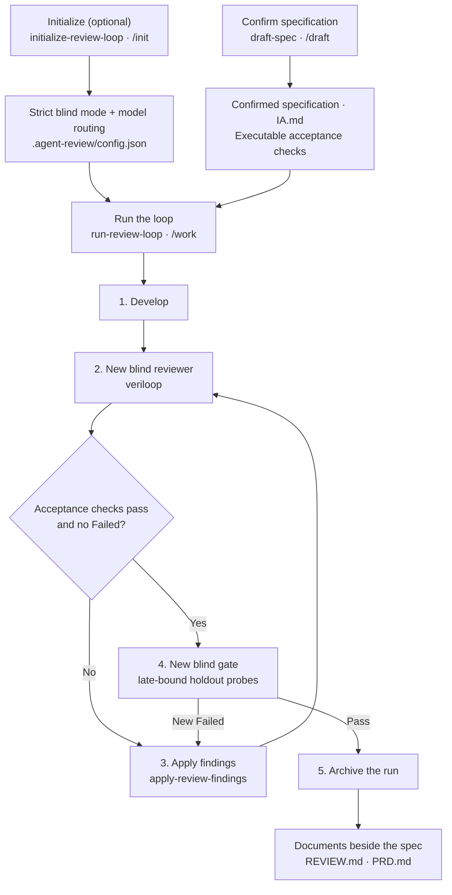

<p align="center">
  <a href="./README.md"></a>
  <a href="./README.ko.md"></a>
</p>

<p align="center">
  <a href="#install"></a>
  &nbsp;&nbsp;
  <a href="#recommended-workflow"></a>
</p>

<p align="center">
  <a href="https://github.com/dev-geon/veriloop/stargazers"></a>
  <a href="https://github.com/dev-geon/veriloop/releases/latest"></a>
  <a href="https://github.com/dev-geon/veriloop/blob/main/LICENSE"></a>
</p>

<p align="center">
  <kbd>skills 6</kbd>
  <kbd>review passes 5</kbd>
  <kbd>platforms Codex + Claude</kbd>
  <kbd>blind mode strict</kbd>
</p>

# Veriloop
A **spec-grounded code review and repair loop** for Codex and Claude Code.

It checks agent-written changes from five perspectives, then repeats for up to three iterations until no failed finding remains and the goal's acceptance checks pass as executable commands.

## Skill architecture



`veriloop` also works on its own. If there is no confirmed specification, it routes to `draft-spec` first instead of approving spec-less work by guesswork.

## Recommended workflow

| Step | Codex | Claude Code | Output |
|---|---|---|---|
| 0. Configure role models *(optional)* | `$initialize-review-loop` | `/init` | Strict blind mode, model routing, and findings ledger |
| 1. Confirm the work specification | `$draft-spec` | `/draft` | `IA.md` — a repository-grounded spec with executable acceptance checks |
| 2. Develop, review, and repair | `$run-review-loop <goal>` | `/work <goal>` | Verified changes, a final verdict in `REVIEW.md`, and `PRD.md` on success |

### 0. Initialize the loop *(optional)*

Choose the model used for each role: developer, fixer, reviewer, and final gate.

```text
# Codex
$initialize-review-loop

# Claude Code
/init
```

The selection and `"blind_mode": "strict"` are stored in `.agent-review/config.json`. If a configured model is unavailable, the loop stops instead of silently substituting another one.

### 1. Draft and confirm the specification

`draft-spec` first inspects the repository's `AGENTS.md` / `CLAUDE.md`, relevant code, tests, and established patterns. It then writes a work specification in which every acceptance criterion is paired with a command that can actually verify it, such as a test or a grep assertion.

```text
# Codex
$draft-spec add a per-vehicle fuel total API

# Claude Code
/draft add a per-vehicle fuel total API
```

Before you confirm the draft, an independent guess-hunt review looks for decisions that were assumed rather than grounded in the repository or your intent. The implementation loop does not start until you confirm the specification.

### 2. Run the loop with an explicit goal

The goal should cite the confirmed specification and state the verifiable outcome.

```text
# Codex
$run-review-loop implement the fuel-total API per docs/fleet-fuel-spec.md while preserving existing data and callers

# Claude Code
/work implement the fuel-total API per docs/fleet-fuel-spec.md while preserving existing data and callers
```

Each iteration follows the same sequence:

1. Implement the specification, unless the target diff already exists.
2. Create a unique blind reviewer and run `veriloop` across five focused passes.
3. Run the acceptance checks and inspect the review for `Failed` findings.
4. Repair verified failures, then review again.
5. Freeze the candidate, then create a different blind gate that generates new holdout probes after implementation.

### Strict blind mode *(default)*

Developers receive the specification and basic acceptance checks, but not review
reports, the review checklist, gate plans, holdout probes, or reviewer reasoning.
Every iteration reviewer and final gate is a new subagent. Each receives only the
repository, frozen target, confirmed specification, scope bounds, and risk focus;
the controller keeps the ledger and all prior history.

The final gate creates late-bound probes after the candidate is frozen: boundary and
invalid inputs, state ordering, failure injection, property/metamorphic or
differential behavior, and test-strength checks. It cannot modify the target
worktree. If the host cannot provide a clean subagent context, the loop stops and
asks whether you authorize reduced independence for that run only. Relaxed mode is
never persisted or inferred from an earlier approval.

### 3. Stop and inspect the result

The loop succeeds only when all of these conditions hold:

- Every executable acceptance check in the specification passes.
- The review verdict is `Pass` or `Pass with warnings`.
- The frozen snapshot is unchanged, every late-bound gate probe passes, and the gate finds no new `Failed` item.

The loop is capped at three iterations. If failures stop decreasing or recur, it escalates the decision to you. Warnings do not keep the loop running; each remaining warning is explicitly accepted, filed as follow-up work, or fixed now.

Completed runs are archived under `.agent-review/runs/`.

### Documents the loop leaves behind

Three files sit together in the work's own directory, beside the confirmed specification:

| File | Contents | Written by |
|---|---|---|
| `IA.md` | The specification: requirements and executable acceptance criteria | `draft-spec` |
| `REVIEW.md` | Findings with severity and `file:line` evidence, the verdict, and the machine-readable JSON block | any review, standalone or inside the loop |
| `PRD.md` | The product document: what the thing is, who uses it, what it does, how it works, its non-functional properties, a verification chapter with every acceptance criterion's Pass/Fail and evidence, and what remains | `run-review-loop`, only on a `goal_met` exit |

`IA.md` is the contract, `REVIEW.md` is the audit, and `PRD.md` is the description of what now exists — written for someone who was not in the room. The acceptance-criteria table is one chapter of it, not the whole document. A run that stops at the iteration cap, makes no progress, or loses a worker writes no product document, and the report says why.

When a program spans many pieces of work, the pair scales: a program-level `IA.md` and `PRD.md` describe the whole in the parent directory, while each piece keeps its own pair beside it.

## Use only the piece you need

### Review the current change

Ask naturally or invoke `$veriloop` directly:

- “Review what the agent just changed.”
- “Check this diff before I commit.”
- “Is this branch safe to merge?”

Scope is resolved in this order: **a PR, commit range, or path you name → uncommitted changes → the current branch against the default branch's merge base**. Review mode does not modify code. The report is persisted as `REVIEW.md` beside the specification; a standalone review writes no delivery record.

### Apply an existing review report

```text
$apply-review-findings
```

The skill re-verifies each `Failed` item against the actual code, repairs it, and reports resolved findings as `Pass`.

## The five review passes

| Pass | What it checks |
|---|---|
| **Regression** | Unupdated callers of changed symbols, broken serialization contracts, silently weakened tests |
| **Performance** | N+1 queries, I/O in loops, sync-over-async, unbounded reads, missing pagination |
| **Cost** | Traffic- or data-scaled API, LLM, SMS, map, egress, logging, and Cosmos DB RU costs |
| **Readability** | Narration comments, excessive defensive wrapping, speculative generality, dead code |
| **Conventions** | The current repository's rules, linters, and neighboring patterns—not generic best practice |

Every finding is rechecked against the code and marked `Confirmed` or `Needs verification`. Results are classified as `Failed` or `Warning` and roll up to `Pass`, `Pass with warnings`, or `Fail`. Checks that found nothing—and findings that have been fixed—are reported explicitly as `Pass`.

## Install

### Codex

```bash
codex plugin marketplace add dev-geon/veriloop
codex plugin add veriloop@veriloop
```

Start a new Codex task after installation so the bundled skills are discovered.

### Claude Code

```text
/plugin marketplace add dev-geon/veriloop
/plugin install veriloop@veriloop
```

No configuration is required. The plugin discovers the repository's conventions at review time.

## Run state and CI

| Path | Purpose |
|---|---|
| `.agent-review/config.json` | Per-role model routing |
| `.agent-review/ledger.json` | Finding state across iterations: open, Pass, recurred, accepted |
| `.agent-review/runs/` | Archived run records |

### Automation reliability

| Layer | Description |
|---|---|
| **Shared workflow core** | Codex skills and Claude Code slash commands route to the same specification, review, repair, and gate instructions so both platforms follow one behavior contract. |
| **Role-isolated handoffs** | Developer, fixer, reviewer, gate, and controller receive only the inputs needed for their responsibility. Developer and fixer completion states explicitly distinguish success from timeout, cancellation, context limits, tool failures, and invalid results. |
| **Schema-constrained results** | Worker, review, gate, and archived run outputs conform to the JSON Schemas under `schemas/`. Worker envelopes are capped at 16 KiB; long logs stay in verified artifacts and are not loaded into controller or reviewer context on successful paths. |
| **Controller contract regression** | A dependency-free local suite executes fixture assertions and verifies strict/reduced transitions, fresh reviewer identities, final-revision acceptance, frozen snapshots, archive consistency, no-progress stops, and gate-failure recovery before a live model run. |

```bash
python3 evals/run_contract_evals.py
```

The suite covers three primary controller traces, one explicitly authorized reduced-mode transition, three worker termination transitions, 24 workflow mutations, seven valid worker envelopes, 21 worker-result mutations, and six raw-JSON fallback paths without API calls. It validates orchestration records and executable evidence; actual model-context isolation and subjective review quality still require a live forward test with fresh subagents.

Every review report ends with a machine-readable JSON block containing `verdict` and `findings[]`. See [docs/ci.md](docs/ci.md) for schema details, the local contract suite, a GitHub Actions gate, and a Claude Code Stop-hook recipe.

> **Claude Code only:** To enforce a review on sessions that do not invoke the loop, add a Stop hook in your own Claude Code settings. Hooks are user-owned harness configuration, so the plugin documents this setup instead of installing it.

## Repository structure

<details>
<summary>Show plugin files</summary>

```text
.agents/plugins/marketplace.json  # Codex Git marketplace entry
.codex-plugin/plugin.json         # Codex plugin manifest
.claude-plugin/plugin.json        # Claude Code plugin manifest
commands/
├── init.md                       # Thin Claude entry point for initialization
├── draft.md                      # Thin Claude entry point for specification
└── work.md                       # Thin Claude entry point for the shared loop
skills/
├── initialize-review-loop/       # Role-model routing and ledger setup
├── draft-spec/                   # Repository analysis → draft → confirmation
├── run-review-loop/              # Develop → review → repair → final gate
├── veriloop/                     # Independent five-pass blind review
└── apply-review-findings/        # Repair verified findings
schemas/                           # Review, gate, and archived-run contracts
evals/                             # Executable controller traces and guard mutations
```

</details>

## License

MIT
